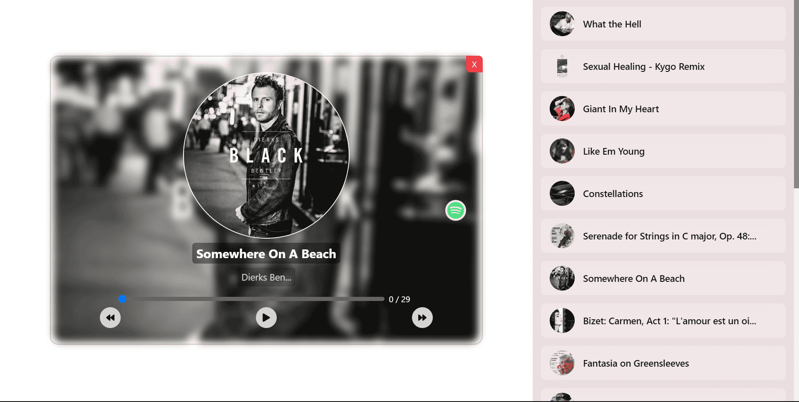

# Echo Tune 🎶

## Overview 📝

Echo Tune is a web application that allows users to discover new music using the Spotify API. The app provides a seamless experience for browsing tracks, listening to previews, and even navigating to Spotify to enjoy the full versions. Built with React.js and Tailwind CSS, the app offers a responsive, visually appealing design with easy-to-use controls.

## Demo 🚀

You can check out the live version of Echo Tune here:  
[Echo Tune Live](https://3bdulrahmn69-echotune.netlify.app/)

[Live Demo](https://3bdulrahmn69-echotune.netlify.app/) | [GitHub Repository](https://github.com/3bdulrahmn69/echo_tune)



## Features ✨

- **Music Discovery:** Browse and discover new music tracks from the Spotify API.
- **Responsive UI:** Tailored for both desktop and mobile devices using Tailwind CSS.
- **Music Playback:** Listen to previews of tracks and control playback with next/previous buttons.
- **Spotify Integration:** Direct links to Spotify for full track listening.
- **Random Track Selection:** Play a random track when no specific one is chosen.

## Tech Stack 💻

- **React.js:** Frontend framework for building the user interface.
- **Tailwind CSS:** Utility-first CSS framework for responsive and modern styling.
- **Spotify API (via RapidAPI):** Used to fetch track data from Spotify's vast music catalog.
- **Axios:** Promise-based HTTP client for making API requests to the Spotify API.

## Installation 📦

To run Echo Tune locally, follow these steps:

1. Clone the repository:

   ```bash
   git clone https://github.com/3bdulrahmn69/echo_tune.git
   cd echo_tune
   ```

2. Install dependencies:

   ```bash
   npm install
   ```

3. Set up environment variables:

   - Create a `.env` file in the root directory.
   - Add your **RapidAPI key** for the Spotify API:
     ```
     VITE_RAPIDAPI_KEY=your_rapidapi_key
     ```

4. Start the development server:

   ```bash
   npm run dev
   ```

5. Open the application in your browser:
   ```
   http://localhost:5173
   ```

## How It Works 🛠️

1. **Spotify API Integration:**  
   Echo Tune fetches data from the Spotify API using RapidAPI. It retrieves track details like album art, artist names, and preview URLs.

2. **Track List and Player:**  
   Users can select tracks from a list, and the selected track will play in the custom-built music player. The player includes controls for next/previous track navigation and track play/pause functionality.

3. **Responsive Design:**  
   The app is fully responsive, adapting its layout and controls for mobile, tablet, and desktop devices, all thanks to Tailwind CSS.

## Future Improvements 🔮

- **Search Functionality:** Add a feature to search for specific songs, artists, or albums.
- **Playlist Support:** Allow users to create and manage playlists from the track list.
- **Full Spotify Integration:** Allow users to log in with Spotify to access personalized recommendations.

## License 📄

This project is licensed under the MIT License.

---

Developed with ❤️ by [3bdulrahmn69](https://github.com/3bdulrahmn69)
